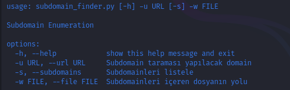
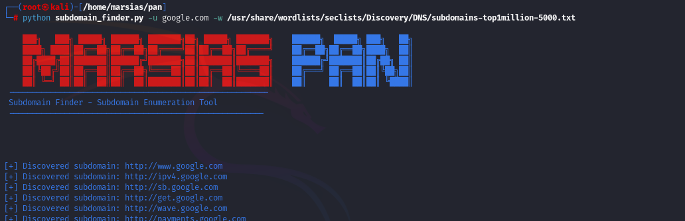

<h1>Önemli</h1>

<h2>1. Asenkron Programlama ile Verimlilik</h2>
<ul>
  <li>
    <strong>asyncio</strong> ve <strong>aiohttp</strong> kullanarak asenkron istekler göndermek, çoklu web isteklerini paralel olarak yapmanızı sağlar. 
    Bu, özellikle zaman alıcı işlemlerde (örneğin, birçok URL'yi kontrol etmek) zaman tasarrufu sağlar.
  </li>
  <li>
    <code>asyncio.create_task()</code> fonksiyonu ile birçok HTTP isteği aynı anda yapılabilir, bu da daha hızlı bir sonuç sağlar.
  </li>
</ul>

<h2>Görseller:</h2>

  
   
  
   
  

